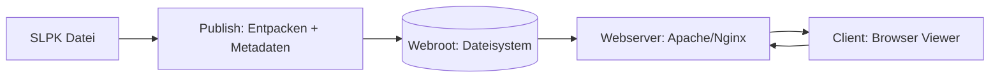
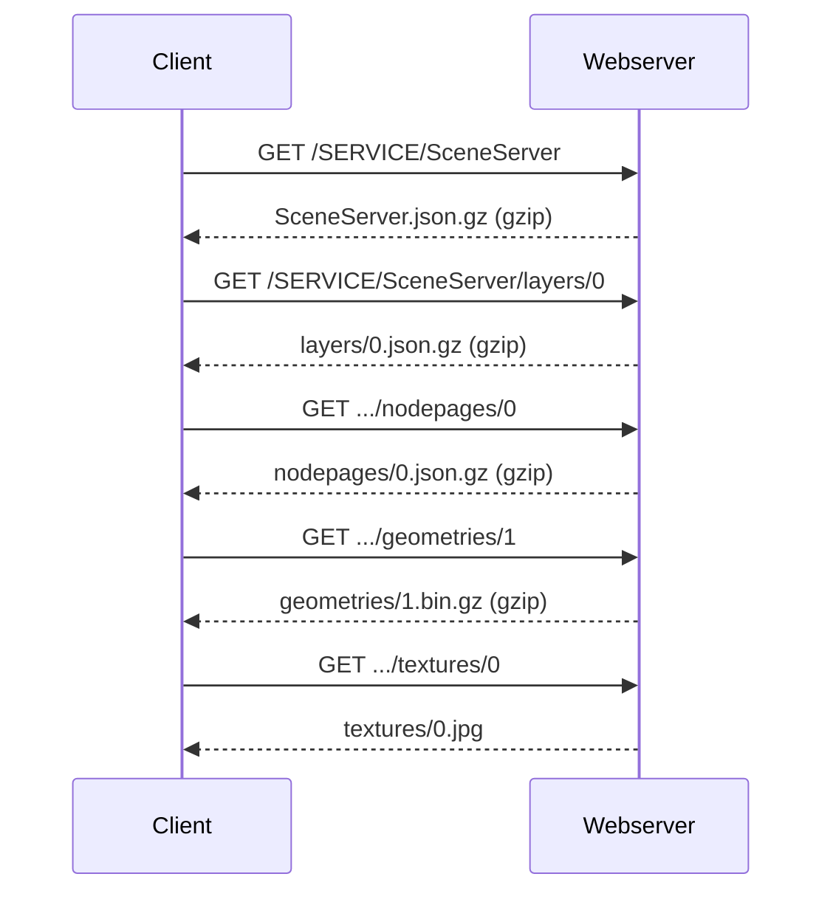
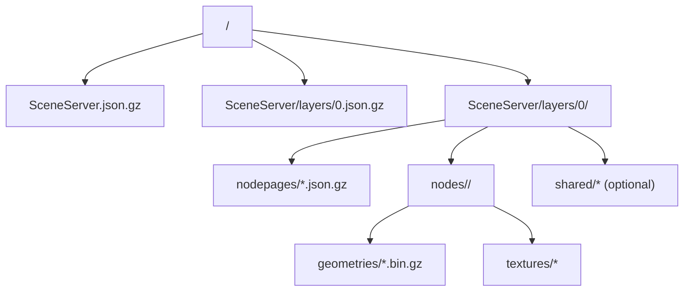
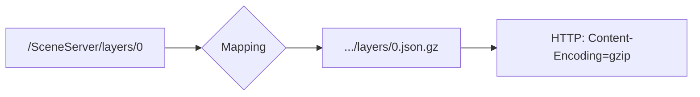
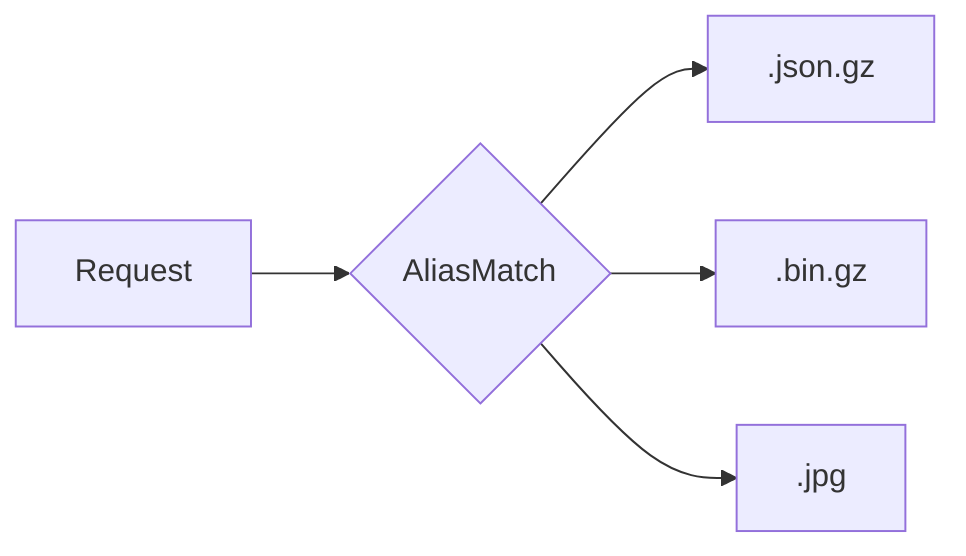
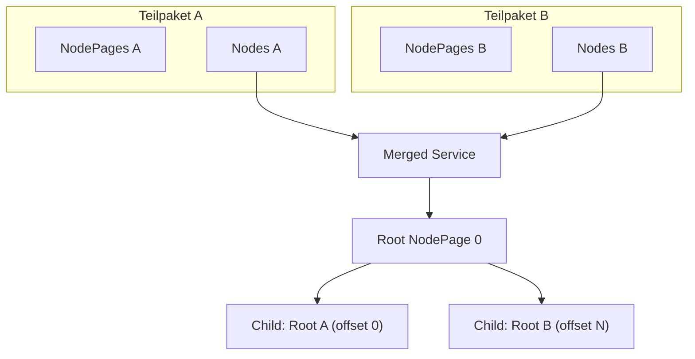

# SLPK (Integrated Mesh) als statischer I3S-SceneServer über Webserver veröffentlichen

Diese Dokumentation beschreibt ein praxiserprobtes Vorgehen, um **ArcGIS Scene Layer Packages (SLPK)** – insbesondere **Integrated Mesh** – **ohne ArcGIS Server** als **statischen I3S/SceneServer** über einen Webserver (z. B. Apache) bereitzustellen.

Zusätzlich ist ein Merge-Ansatz (mehrere SLPKs → ein Service) dokumentiert sowie ein lokaler Dev-Server + Web-Viewer für Tests.


---

## Inhalt

1. [Kurzüberblick](#1-kurzüberblick)  
2. [Begriffe und Datenmodell](#2-begriffe-und-datenmodell)  
3. [Zielarchitektur](#3-zielarchitektur)  
4. [Datenlayout und Endpunkte](#4-datenlayout-und-endpunkte)  
5. [Publishing einer einzelnen SLPK](#5-publishing-einer-einzelnen-slpk)  
6. [Apache-Konfiguration (Produktion)](#6-apache-konfiguration-produktion)  
7. [Lokaler Test (Dev-Server + Viewer)](#7-lokaler-test-dev-server--viewer)  
8. [Merge mehrerer SLPKs](#8-merge-mehrerer-slpks)  
9. [Validierung & Smoke-Checks](#9-validierung--smoke-checks)  
10. [Troubleshooting](#10-troubleshooting)  
11. [Betrieb: Security & Performance](#11-betrieb-security--performance)  
12. [Cheatsheet](#12-cheatsheet)

---

## 1. Kurzüberblick

**Kernaussage:**  
Ein **SLPK** ist (praktisch) ein ZIP-Container, der bereits alle I3S-Ressourcen enthält (JSON, NodePages, Geometrien, Texturen). Ein „I3S SceneServer“ ist für den Client nur eine **URL-Struktur**, unter der diese Ressourcen **per HTTP** abrufbar sind. Der Server rendert nichts.

Die Bereitstellung ohne ArcGIS Server klappt zuverlässig, wenn:

- SLPK **entpackt** wird (strukturtreu),
- Metadaten so abgelegt werden, dass der Client die Standard-Endpunkte findet,
- der Webserver `.json.gz`/`.bin.gz` korrekt als gzip ausliefert, CORS erlaubt und Endpunkte ohne Dateiendung auf Dateien mit Dateiendung mappt.

---

## 2. Begriffe und Datenmodell

### 2.1 SLPK
- Scene Layer Package (ZIP)
- enthält u. a. `3dSceneLayer.json.gz` (Layer-Descriptor) und Ressourcen für Streaming

### 2.2 I3S / SceneServer
- URL-basiertes Ressourcenmodell („REST“) für 3D Scene Layers
- Client lädt nur die benötigten Knoten (LOD/Nodes), nicht die gesamte Szene

### 2.3 Wichtige Eigenschaften im Layer-Descriptor (`layers/0.json.gz`)
- `spatialReference` (CRS + optional VCS)
- `store.extent` / `fullExtent` (Initial View)
- `nodePages.nodesPerPage` (Merge-relevant)
- `textureEncoding` + `textureSetDefinitions` (JPG/DDS)
- `geometryDefinitions` (z. B. Draco-Kompression)

---

## 3. Zielarchitektur



---

## 4. Datenlayout und Endpunkte

### 4.1 Endpunkte (Client-Sicht)

Der Client erwartet Endpunkte ohne Dateiendung:

- `/<service>/SceneServer`
- `/<service>/SceneServer/layers/0`
- `.../nodepages/<n>`
- `.../geometries/<id>`
- `.../textures/<id>`



### 4.2 Filesystem-Struktur (Referenz)



### 4.3 URL-Mapping (Webserver-Idee)

Der Webserver muss URLs ohne Endung auf Dateien mit Endung mappen:



---

## 5. Publishing einer einzelnen SLPK

### 5.1 Ziel

Eine einzelne SLPK wird als Service veröffentlicht:

- `https://i3s.sn.de/<service>/SceneServer`

### 5.2 Publishing (Python)

**Datei (Repo):** `publish_slpk_static.py`

Funktion:
1. entpackt `*.slpk` nach `<webroot>/<service>/SceneServer/layers/0/`
2. verschiebt `3dSceneLayer.json.gz` → `<webroot>/<service>/SceneServer/layers/0.json.gz`
3. erzeugt `<webroot>/<service>/SceneServer.json.gz`

### 5.3 Beispiel: Publish auf Linux/Webserver

```bash
python3 publish_slpk_static.py   --slpk "/pfad/DSM_Mesh-heidenau.slpk"   --webroot "/data/www/i3s.sn.de"
```

Ergebnis (Beispiel):
- `/data/www/i3s.sn.de/DSM_Mesh-heidenau/SceneServer.json.gz`
- `/data/www/i3s.sn.de/DSM_Mesh-heidenau/SceneServer/layers/0.json.gz`
- `/data/www/i3s.sn.de/DSM_Mesh-heidenau/SceneServer/layers/0/...`

---

## 6. Apache-Konfiguration (Produktion)

### 6.1 Anforderungen
- CORS aktiv (Browser)
- `.gz` korrekt als gzip deklarieren (`RemoveType .gz` + `AddEncoding gzip .gz`)
- Endpunkte ohne Endung auf Dateien mit Endung mappen (AliasMatch)
- `DirectorySlash Off` (keine Redirects)
- `FollowSymLinks` (falls Links eingesetzt werden)

### 6.2 AliasMatch-Pattern

**Datei (Repo):** `geobasis_mesh_sn.conf` (Beispiel)

Logik:
- `SceneServer`, `layers/0`, `nodepages`, `shared` → `.json.gz`
- `geometries`, `attributes` → `.bin.gz`
- `textures` → `.jpg`



### 6.3 Deployment-Schritte (Produktion)

1. Zielpfad auf Server: `/data/www/i3s.sn.de/<service>/...`
2. Apache vHost `i3s.sn.de` → DocumentRoot `/data/www/i3s.sn.de`
3. Include `geobasis_mesh_sn.conf` in vHost-Kontext
4. Apache Reload

---

## 7. Lokaler Test (Dev-Server + Viewer)

### 7.1 Warum nicht `python -m http.server`
Standard-HTTP-Server liefert nur Dateien 1:1. I3S erwartet jedoch:
- URL-Endpunkte ohne Endungen
- `Content-Encoding: gzip` für `.json.gz`/`.bin.gz`
- konsistentes Mapping für Texturen

### 7.2 Dev-Server (NRW-URL-Mapping lokal)

**Datei (Repo):** `i3s_dev_server.py`  
**Start (PowerShell):**

```powershell
powershell -ExecutionPolicy Bypass -File .\run_i3s_dev_server.ps1 `
  -Webroot "C:\DZ\i3s\webroot" `
  -Service "DSM_Mesh-heidenau" `
  -Port 8000
```

### 7.3 Web-Viewer

**Datei:** `<webroot>/viewer/index.html`  
Aufruf:

```text
http://127.0.0.1:8000/viewer/index.html?url=http://127.0.0.1:8000/DSM_Mesh-heidenau/SceneServer
```

---

## 8. Merge mehrerer SLPKs

### 8.1 Merge
- Mesh wird kachel-/losweise als mehrere SLPKs exportiert
- Ziel: ein einziger I3S-Service

### 8.2 Merge-Prinzip (Offset, kollisionsfrei)

Problem: Node-IDs und Resource-IDs kollidieren zwischen Paketen.  
Lösung: pro Teilpaket ein **Offset**:

- `offset = pages_written * nodesPerPage`
- Node-Index, Children-IDs und Resource-IDs werden um `offset` erhöht
- Root-NodePage (Index 0) referenziert die Root-Nodes der Teilpakete als Children




### 8.3 Voraussetzungen (Checkliste)
- identischer `nodesPerPage`
- identische CRS/VCS
- kompatible LOD-/Tiling-Parameter
- konsistente Texturstrategie (empfohlen: JPG)

### 8.4 Merge-Skript
**Datei (Repo):** `eslpk_merge.py` (Bundesland-Variante)

Typischer Ablauf:
1. alle SLPKs extrahieren (wie Single Publish) in ein Arbeitsverzeichnis
2. NodePages/Nodes mit Offsets zusammenführen
3. neuen Root erzeugen (Children → Root-Knoten der Teilpakete)
4. Ergebnis als ein Service veröffentlichen

---

## 9. Validierung & Smoke-Checks

### 9.1 HTTP Checks (Produktion)
```bash
curl -I https://i3s.sn.de/<service>/SceneServer
curl -I https://i3s.sn.de/<service>/SceneServer/layers/0
```

Erwartet:
- `200 OK`
- `Content-Encoding: gzip`
- CORS Header (mindestens `Access-Control-Allow-Origin`)

### 9.2 Browser Checks
DevTools → Network:
- `nodepages/*` → 200
- `geometries/*` → 200
- `textures/*` → 200

---

## 10. Troubleshooting

### 10.1 Nur Directory Listing statt JSON
Ursache: kein URL-Mapping (AliasMatch/Rewrite).  
Fix: Apache-Konfig oder Dev-Server verwenden.

### 10.2 Texturen 404
Ursache: angeforderter Name passt nicht zum tatsächlichen Dateinamen (z. B. `0_1` vs. `0_1.bin.dds.gz` oder `0.jpg`).  
Fix: robustes Textur-Mapping oder DDS deaktivieren (JPG-only).

### 10.3 Mesh wird schwarz
Ursache: DDS/komprimierte Texturen werden zwar geladen, aber Shader-Pfad scheitert.  
Fix: DDS aus Layer-Metadaten entfernen und `.jpg` ausliefern.

### 10.4 `curl.exe` landet im Proxy
Fix:
```powershell
curl.exe --noproxy "*" -I "http://127.0.0.1:8000/..."
```

---

## 11. Betrieb: Security & Performance

- HTTPS/TLS in Produktion
- CORS in Produktion möglichst auf definierte Origins einschränken
- Caching: `Cache-Control` für Texturen/Geometrien (CDN-freundlich)
- Range Requests bei großen Binärdaten
- Logging/Monitoring: 404/5xx, Bandbreite, Latenzen

---

## 12. Cheatsheet

### Publish
```bash
python3 publish_slpk_static.py --slpk "/pfad/file.slpk" --webroot "/data/www/i3s.sn.de"
```

### Lokal: Dev-Server + Viewer
```powershell
powershell -ExecutionPolicy Bypass -File .\run_i3s_dev_server.ps1 -Webroot "C:\DZ\i3s\webroot" -Service "DSM_Mesh-heidenau" -Port 8000
```

Viewer:
```text
http://127.0.0.1:8000/viewer/index.html?url=http://127.0.0.1:8000/<service>/SceneServer
```
