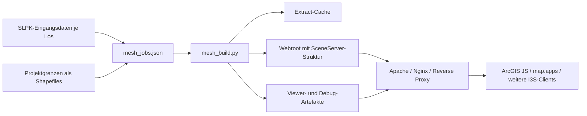
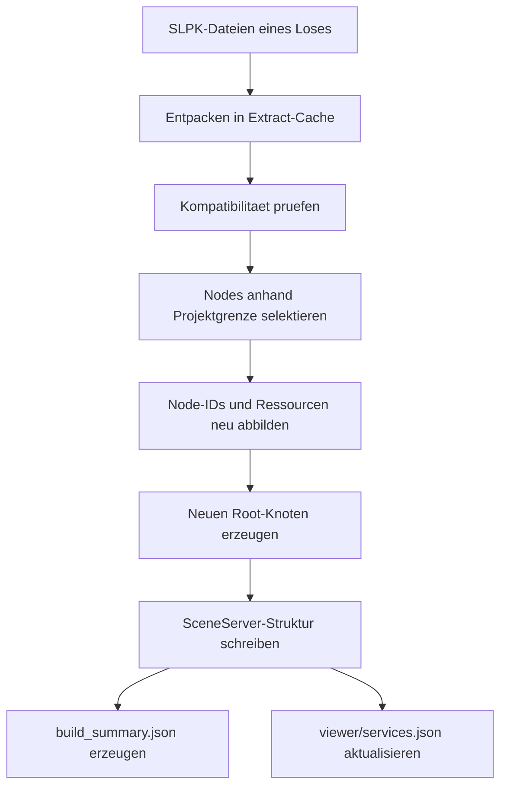
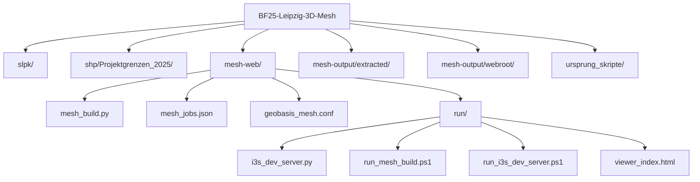
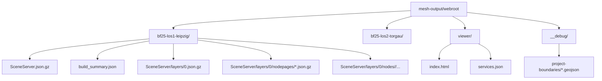
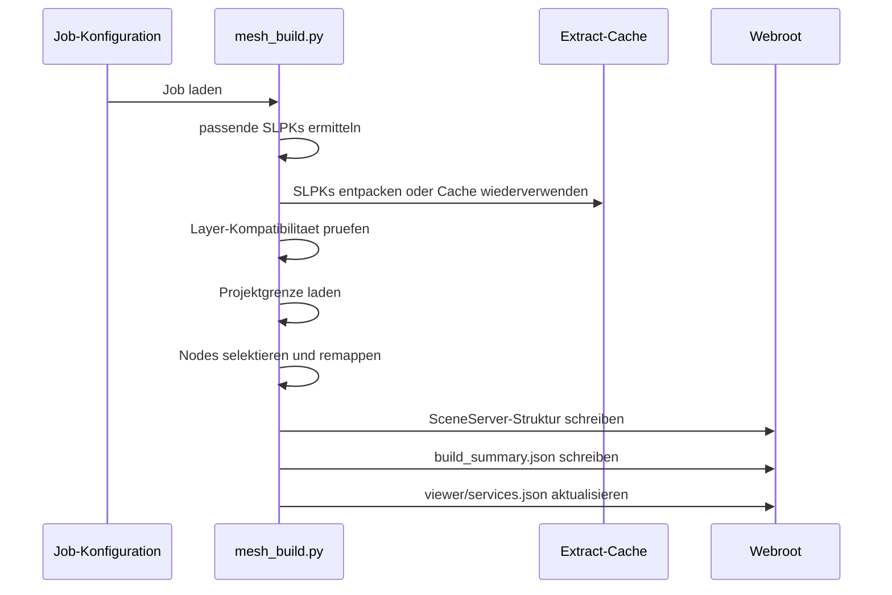
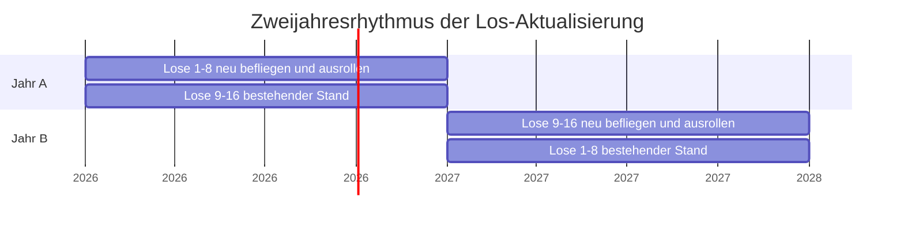

# Sachsenweites 3D-Mesh als statischer I3S/SceneServer

Diese Dokumentation beschreibt den **aktuellen Stand** des Projekts zur Bereitstellung eines sachsenweiten 3D-Meshes als **statischer I3S-/SceneServer-Dienst** auf Basis mehrerer SLPK-Dateien je Los.

- mehrere SLPKs pro Gebiet werden zu **einem Service** zusammengefuehrt,
- Teilbereiche werden anhand von **Projektgrenzen** zugeschnitten,
- Services werden **konfigurationsgesteuert** gebaut,
- ein **lokaler Dev-Server** und ein **Viewer** stehen fuer Tests bereit,
- eine **produktionsnahe Apache-Konfiguration** liegt als Vorlage vor,
- fuer den spaeteren Betrieb mit **16 Losen** wird ein Update- und Release-Modell benoetigt.


---

## Inhalt

1. Kurzfazit
2. Ausgangslage und Einordnung
3. Aktueller technischer Stand
4. Zielarchitektur des heutigen Systems
5. Projekt-, Daten- und Verzeichnisstruktur
6. Build- und Publish-Prozess
7. Lokaler Testbetrieb
8. Produktionsfreigabe und Rolle des Webservers
9. Betriebsmodell fuer 16 Lose und turnusmaessige Aktualisierung
10. Update ohne sichtbare Unterbrechung
11. Alt -> neu -> Wirkung
12. Offene Punkte und naechste Schritte
13. Cheatsheet


---

## 1. Kurzfazit

### 1.1 Fachliches Ergebnis

Heute existiert eine Pipeline, die:

- mehrere SLPKs eines Loses zusammenfuehrt,
- daraus einen statischen I3S-Service erzeugt,
- den Dienst an Projektgrenzen zuschneidet,
- die Ausgabe in ein webserverfaehiges Webroot schreibt,
- Zusatzartefakte fuer Test und Betrieb erzeugt.

### 1.2 Was bereits vorhanden ist

- Build-Logik fuer mehrere Lose
- Job-Konfiguration per JSON
- Extract-Cache
- Build-Ausgabe im Format `<service>/SceneServer/...`
- lokaler I3S-Dev-Server
- lokaler Viewer
- produktionsnahe Apache-Vorlage

### 1.3 Was noch fehlt

Fachlich fehlt **nicht** mehr die Grundidee der Apache-Auslieferung, wohl aber die **produktive Betriebsintegration**:

- reale Domain / DNS
- TLS-Zertifikat
- produktiver Apache- oder gleichwertiger Reverse-Proxy-Betrieb
- Deployment-Konzept fuer Releases und Updates
- Festlegung, wie neue Los-Jahrgaenge ohne sichtbare Stoerung ausgerollt werden

### 1.4 Weiteres Vorgehen


- Rohes `*.slpk` ist nur ein Paketcontainer und **kein direkt konsumierbarer SceneServer-Endpunkt**.
- Der Client erwartet **entpackte I3S-Ressourcen**.
- Der Client fordert **Endpunkte ohne Dateiendung** an.
- Der Webserver muss daher `.json.gz` und `.bin.gz` mit korrektem `Content-Encoding: gzip` ausliefern.
- Fuer Browserbetrieb werden CORS-Header benoetigt.

Notwendig daher: Diese Struktur ueber Apache, Nginx oder einen funktional gleichwertigen Web-Layer veroeffentlichen.


---

## 2. Ausgangslage und Einordnung

### 2.1 Heute

Der aktuelle Stand ist ein **losbezogenes Multi-SLPK- und Multi-Service-System**.

Ein Los besteht dabei nicht zwingend aus einer einzelnen Datei, sondern haeufig aus mehreren exportierten Teil-SLPKs. Diese werden:

- je Los eingesammelt,
- auf Kompatibilitaet geprueft,
- anhand der Projektgrenze gefiltert,
- zu einem veroeffentlichbaren Service zusammengefuehrt.

### 2.2 Der eigentliche Wechsel im Skript

Der groesste Unterschied liegt nicht nur in "mehr Dateien", sondern in der **Art des Betriebs**:

- von einem Skript zu einer Build-Pipeline,
- von manueller Kommandozeile zu Job-Konfiguration


---

## 3. Aktueller technischer Stand

### 3.1 Relevante Komponenten

Die aktuelle Arbeitsstruktur baut auf folgenden Bausteinen auf:

- `mesh-web/mesh_build.py`
- `mesh-web/eslpk_merge.py`
- `mesh-web/mesh_jobs.json`
- `mesh-web/run/i3s_dev_server.py`
- `mesh-web/run/run_mesh_build.ps1`
- `mesh-web/run/run_i3s_dev_server.ps1`
- `mesh-web/run/viewer_index.html`
- `mesh-web/geobasis_mesh.conf`

### 3.2 Rolle der Dateien

| Datei | Rolle |
|---|---|
| `mesh-web/mesh_build.py` | Zentrale Build-Logik fuer Extract, Merge, Clip, Publish |
| `mesh-web/eslpk_merge.py` | Kompatibilitaets-Einstiegspunkt auf die neue Build-Logik |
| `mesh-web/mesh_jobs.json` | Definition der Jobs, Lose, SLPK-Prefixe und Clip-Grenzen |
| `mesh-web/run/i3s_dev_server.py` | Lokaler HTTP-Server mit I3S-URL-Mapping |
| `mesh-web/run/viewer_index.html` | Lokaler Viewer fuer mehrere Services |
| `mesh-web/geobasis_mesh.conf` | Apache-Vorlage fuer die produktive Auslieferung |

### 3.3 Aktueller Stand im Arbeitsverzeichnis

Im vorliegenden Arbeitsstand existieren bereits:

- lokale Service-Ausgaben fuer `bf25-los1-leipzig`
- lokale Service-Ausgaben fuer `bf25-los2-torgau`
- Debug-Grenzen fuer acht Lose
- ein lokaler Viewer mit `services.json`

### 3.4 Statusbild

| Thema | Status |
|---|---|
| Multi-SLPK-Merge | umgesetzt |
| Losbezogenes Clipping | umgesetzt |
| Konfigurationsgesteuerter Build | umgesetzt |
| Lokaler Dev-Server | umgesetzt |
| Lokaler Viewer | umgesetzt |
| Apache-Template | umgesetzt |
| Produktiver Serverbetrieb | ausstehend |
| Release-/Update-Modell fuer laufenden Betrieb | fachlich zu definieren |


---

## 4. Zielarchitektur des heutigen Systems

### 4.1 Gesamtarchitektur



### 4.2 Heutiger Build-Gedanke



### 4.3 Warum dieses Modell sinnvoll ist

Das Modell trennt drei Verantwortungen sauber:

- **Datenaufbereitung** im Build
- **statische Auslieferung** im Webroot
- **oeffentliche Erreichbarkeit** im Webserver

Dadurch bleibt der Betrieb vergleichsweise einfach: der Webserver rendert nichts, sondern liefert nur Dateien und Metadaten korrekt aus.


---

## 5. Projekt-, Daten- und Verzeichnisstruktur

### 5.1 Projektstruktur



### 5.2 Eingabedaten

Der aktuelle Stand nutzt:

- `slpk/` als Eingang fuer lose SLPK-Dateien
- `shp/Projektgrenzen_2025/` als Quelle fuer die Losgrenzen

Beispiel:

```text
slpk/
  leipzig_0125_1-9.slpk
  leipzig_0125_10-16.slpk
  ...
  torgau_0225_1-7.slpk
  ...

shp/Projektgrenzen_2025/
  BF25_Los1_Leipzig.shp
  BF25_Los2_Torgau.shp
  ...
```

### 5.3 Extract-Cache

Entpackte SLPKs werden nicht jedes Mal blind neu entpackt, sondern in `mesh-output/extracted/` abgelegt.

Das ist wichtig fuer:

- Wiederholbarkeit
- Zeitgewinn bei erneuten Builds
- Trennung zwischen Rohdaten und veroeffentlichter Ausgabe

Referenzstruktur:

```text
mesh-output/extracted/
  leipzig_0125_1-9/
    <size>_<mtime>/
      SceneServer.json.gz
      SceneServer/layers/0.json.gz
      SceneServer/layers/0/...
```

### 5.4 Publizierbares Webroot

Die eigentliche publizierbare Ausgabe wird in `mesh-output/webroot/` geschrieben.

Referenzstruktur:



### 5.5 Logische Service-Endpunkte

Die Clients greifen nicht auf einzelne Dateien mit Endung zu, sondern auf logische Endpunkte:

- `/<service>/SceneServer`
- `/<service>/SceneServer/layers/0`
- `/<service>/SceneServer/layers/0/nodepages/<n>`
- `/<service>/SceneServer/layers/0/nodes/<id>/geometries/<id>`
- `/<service>/SceneServer/layers/0/nodes/<id>/textures/<id>`


---

## 6. Build- und Publish-Prozess

### 6.1 Steuerung ueber `mesh_jobs.json`

Die Jobs werden aktuell zentral ueber `mesh-web/mesh_jobs.json` beschrieben.

Je Job werden u. a. festgelegt:

- interner Job-Name
- oeffentlicher Service-Name
- Titel
- Shapefile fuer die Projektgrenze
- Layer-Name im Shapefile
- SLPK-Prefixe oder explizite SLPK-Dateien

Beispielhafte Logik:

- `bf25-los1-leipzig` sammelt alle SLPKs mit Prefix `leipzig_`
- `bf25-los2-torgau` sammelt alle SLPKs mit Prefix `torgau_`

### 6.2 Build-Schritte im Detail



### 6.3 Wesentliche Verarbeitungsschritte

1. **SLPK-Ermittlung**  
   Pro Job werden passende SLPKs aus `slpk/` gefunden.

2. **Extract oder Cache-Wiederverwendung**  
   Bereits entpackte Pakete werden wiederverwendet, sofern Groesse und Zeitstempel unveraendert sind.

3. **Kompatibilitaetspruefung**  
   Die Layer-Beschreibungen muessen zueinander passen.

4. **Clipping an Projektgrenzen**  
   Auf Basis des Shapefiles werden nur die relevanten Nodes behalten.

5. **Node-Remapping**  
   Neue IDs werden vergeben, Eltern-/Kind-Beziehungen angepasst und Ressourcen neu referenziert.

6. **Neuer Root-Knoten**  
   Der finale Service erhaelt einen neuen Root mit den Teilwurzelknoten der behaltenen SLPK-Anteile.

7. **Schreiben des Zielservices**  
   Ausgabe nach `mesh-output/webroot/<service>/...`

8. **Zusatzartefakte**  
   `build_summary.json`, `viewer/services.json`, optionale Debug-Grenzen

### 6.4 Ergebnis pro Service

Je Service entsteht mindestens:

- `SceneServer.json.gz`
- `SceneServer/layers/0.json.gz`
- `SceneServer/layers/0/nodepages/*.json.gz`
- `SceneServer/layers/0/nodes/<id>/...`
- `build_summary.json`

### 6.5 Bedeutung von `build_summary.json`

`build_summary.json` dokumentiert den Build je Service und ist fuer Betrieb und Nachvollziehbarkeit wertvoll.

Enthalten sind u. a.:

- Job-Name
- Service-Name
- Quelle der SLPKs
- verwendetes Clip-Shapefile
- Anzahl Quell-Nodes
- Anzahl uebernommener Nodes
- Quotient `kept_ratio`

Damit kann nachvollzogen werden, welche Teilpakete in einen Service eingeflossen sind und wie stark der Zuschnitt gewirkt hat.


---

## 7. Lokaler Testbetrieb

### 7.1 Build starten

Beispiel: Jobs auflisten

```powershell
powershell -ExecutionPolicy Bypass -File .\mesh-web\run\run_mesh_build.ps1 -ListJobs
```

Beispiel: alle verfuegbaren Jobs bauen

```powershell
powershell -ExecutionPolicy Bypass -File .\mesh-web\run\run_mesh_build.ps1
```

Beispiel: einzelnes Los neu bauen

```powershell
powershell -ExecutionPolicy Bypass -File .\mesh-web\run\run_mesh_build.ps1 `
  -Job bf25-los1-leipzig `
  -ForceService
```

### 7.2 Dev-Server starten

```powershell
powershell -ExecutionPolicy Bypass -File .\mesh-web\run\run_i3s_dev_server.ps1 `
  -Port 8000 `
  -Service bf25-los1-leipzig
```

### 7.3 Viewer nutzen

Beispiele:

- `http://127.0.0.1:8000/viewer/index.html`
- `http://127.0.0.1:8000/viewer/index.html?service=bf25-los1-leipzig`
- `http://127.0.0.1:8000/viewer/index.html?service=bf25-los1-leipzig&showBoundary=1`

### 7.4 Zweck des lokalen Testbetriebs

Der lokale Testbetrieb dient dazu,

- Build-Ergebnisse schnell zu pruefen,
- URL-Mapping lokal genauso zu simulieren wie spaeter im Webserver,
- mehrere Services parallel zu laden,
- Projektgrenzen gegen das Mesh zu kontrollieren.


---

## 8. Produktionsfreigabe und Rolle des Webservers

### 8.1 Was produktiv benoetigt wird

Fuer die produktive Veroeffentlichung werden mindestens benoetigt:

- Domain
- DNS-Eintrag
- TLS-Zertifikat
- Apache, Nginx oder gleichwertiger Reverse Proxy
- Webroot auf dem Zielserver
- CORS
- korrekte `gzip`-Auslieferung
- URL-Mapping ohne Dateiendungen

### 8.2 Stand der Apache-Konfiguration

Eine **produktionsnahe Vorlage** liegt bereits vor:

- `mesh-web/geobasis_mesh.conf`

Die Konfiguration ist gegenueber der Ursprungsversion bereits deutlich erweitert:

- Umstellung auf `i3s.sn.de`
- Webroot `/data/www/i3s.sn.de`
- CORS fuer `GET`, `HEAD`, `OPTIONS`
- Mapping fuer `SceneServer`, `layers/0`, `nodepages`, `shared`
- Mapping fuer `geometries`, `attributes`
- Unterstuetzung fuer mehrere Texturformate
- Cache-Control-Regeln
- temporaerer Debug-Pfad fuer Projektgrenzen

### 8.3 Was daran noch "aussteht"

Ausstehend ist **nicht** mehr die Grundkonfiguration als Idee, sondern ihre **Anwendung im Betrieb**:

- Integration in echten vHost
- Einbindung des Zertifikats
- Freischaltung auf der Zielmaschine
- Abnahme der Caching-Strategie
- Entscheidung ueber Release-Struktur und Updateverfahren

### 8.4 Produktive Endpunkte

Empfohlenes Schema:

- `https://i3s.sn.de/<service>/SceneServer`
- `https://i3s.sn.de/<service>/SceneServer/layers/0`

Fuer map.apps und vergleichbare Konfigurationen ist der Layer-Endpunkt in der Regel die robustere Variante:

- `https://i3s.sn.de/<service>/SceneServer/layers/0`


---

## 9. Betriebsmodell fuer 16 Lose und turnusmaessige Aktualisierung

### 9.1 Fachliche Randbedingung

Es gibt insgesamt **16 Lose**.

- 8 Lose werden in einem Jahr beflogen.
- Die anderen 8 Lose folgen im darauffolgenden Jahr.
- Damit ergibt sich eine fachliche Aktualitaet von rund **2 Jahren** ueber das Gesamtgebiet.

### 9.2 Konsequenz fuer die Datenorganisation

Die heutige Ablage mit lose nebeneinanderliegenden Dateien unter `slpk/` ist fuer erste Ausbaustufen ausreichend, wird aber fuer den Regelbetrieb unuebersichtlich.

Empfohlen wird eine versions- und losbezogene Eingangsgliederung.

Beispiel:

```text
slpk/
  2026/
    los01-leipzig/
      leipzig_0126_1-9.slpk
      ...
    los02-torgau/
      ...
  2027/
    los09-.../
      ...
```

### 9.3 strukturierte Eingangsablage

verhindert:

- Vermischung alter und neuer Befliegungsjahre
- unbeabsichtigtes Mitnehmen falscher SLPKs per Prefix
- unklare Nachvollziehbarkeit bei Rebuilds

### 9.4 Empfohlene Konfigurationspraxis

Sobald mehrere Jahrgaenge parallel vorliegen, sollte nicht mehr nur ueber Prefixe gearbeitet werden.

Empfohlen ist dann je Job:

- eigenes `slpk_dir` pro Release oder Jahrgang
- optional explizite `slpk_files`

Beispiel:

```json
{
  "name": "bf25-los1-leipzig",
  "service_name": "bf25-los1-leipzig",
  "slpk_dir": "../slpk/2026/los01-leipzig",
  "slpk_files": [
    "leipzig_0126_1-9.slpk",
    "leipzig_0126_10-16.slpk"
  ],
  "clip_shapefile": "BF25_Los1_Leipzig.shp",
  "clip_layer": "BF25_Los1_Leipzig"
}
```

### 9.5 Betriebsmodell je Jahr




---

## 10. Update ohne sichtbare Unterbrechung

### 10.1 Bewertung des aktuellen Stands

Mit dem **heutigen direkten In-Place-Ersatz** eines vorhandenen Services ist ein fuer Benutzer vollstaendig unsichtbares Update **nicht verlaesslich garantiert**.

Gruende:

- bestehende Service-Verzeichnisse werden beim Neuschreiben zunaechst als Backup verschoben,
- danach wird das neue Verzeichnis geschrieben,
- waehrenddessen kann es zu einem kurzen Zwischenzustand kommen,
- Browser, Proxy oder CDN koennen alte und neue Inhalte unter derselben URL cachen,
- insbesondere bei geaenderten NodePages, Geometrien oder Texturen koennen Mischstaende entstehen.

### 10.2 Was aktuell moeglich ist

| Szenario | Bewertung |
|---|---|
| Service im produktiven Pfad direkt ueberschreiben | nicht empfohlen |
| Service kurz offline ersetzen | technisch moeglich, aber sichtbares Risiko |
| Neue Version parallel bereitstellen und danach umschalten | empfohlen |

### 10.3 Empfohlenes Release-Modell

Fuer den Regelbetrieb wird ein **versioniertes Release-Modell** empfohlen.

Prinzip:

1. Neue Lose werden **nicht** direkt in den aktiven oeffentlichen Pfad gebaut.
2. Stattdessen wird in eine **neue Release-Struktur** gebaut.
3. Diese neue Version wird unter einer **Staging- oder Release-URL** getestet.
4. Erst nach Freigabe wird die konsumierende Anwendung auf die neue Version umgestellt.
5. Die alte Version bleibt fuer einen definierten Zeitraum parallel bestehen.

Beispiel:

```text
/data/www/i3s.sn.de/releases/2026A/bf25-los1-leipzig/...
/data/www/i3s.sn.de/releases/2026A/bf25-los2-torgau/...
/data/www/i3s.sn.de/releases/2027B/bf25-los9-.../...
```

### 10.4 Umstellungsvarianten

#### Variante A: Versions-URL in der Anwendung

Die konsumierende Anwendung referenziert explizit eine Release-URL.

Vorteile:

- sauber
- reproduzierbar
- kein Mischcache unter identischen URLs

Nachteil:

- die Anwendungskonfiguration muss bei einem Release angepasst werden


#### Variante B: Stabile URL mit Alias oder Symlink

Eine stabile URL zeigt per Alias oder Symlink auf die aktuell freigegebene Release.

Vorteil:

- oeffentliche URL bleibt gleich

Nachteil:

- Cache-Mischungen sind moeglich, wenn alte und neue Inhalte unter denselben URLs auftreten
- nur mit sehr sauberer Cache-Strategie und ggf. Purge-Prozess vertretbar

### 10.5 Empfehlung fuer dieses Projekt

Fuer einen robusten Betrieb wird empfohlen:

1. **Immutable Releases** pro Aktualisierung erzeugen.
2. Die fachliche Freigabe ueber **konfigurierbare Ziel-URLs** oder einen zentralen Service-Katalog steuern.
3. Alte Releases fuer einen begrenzten Zeitraum parallel halten.
4. Erst danach alte Releases entfernen.

---

## 11. Offene Punkte und naechste Schritte

### 11.1 Vor Erstfreigabe

1. Zielserver und Domain festlegen.
2. TLS-Zertifikat beschaffen und einbinden.
3. Apache-vHost produktiv konfigurieren.
4. Ziel-Webroot bereitstellen.
5. Smoke-Checks fuer SceneServer, Layer, NodePages und Texturen definieren.
6. Debug-Pfade nur fuer Testphase zulassen.

### 11.2 Vor Regelbetrieb

1. Eingangsstruktur fuer SLPKs nach Jahrgang und Los ordnen.
2. Job-Konfiguration auf explizite Release-Quellen umstellen.
3. Release-Namensschema festlegen, z. B. `2026A`, `2027B`.
4. Betriebsentscheidung treffen: versionierte oeffentliche URLs oder stabile Alias-URLs mit strengem Cache-Management.
5. Rollback-Verfahren definieren.

### 11.3 Fuer spaetere Aktualisierungen

1. Neue Befliegungslose separat einlesen.
2. Nur geaenderte Lose neu bauen.
3. Neue Releases parallel testen.
4. Anwendungen gezielt auf neue Releases umstellen.
5. Alte Releases zeitverzoegert entfernen.

### 11.4 Empfohlene Prioritaet

Die naechsten fachlich sinnvollen Schritte sind:

1. ProduktionsvHost technisch fertigstellen.
2. Release-Modell fuer Updates festlegen.
3. SLPK-Eingangsdaten strukturiert versionieren.


```

### 13.3 Wichtige lokale URLs

- `http://127.0.0.1:8000/viewer/index.html`
- `http://127.0.0.1:8000/bf25-los1-leipzig/SceneServer`
- `http://127.0.0.1:8000/bf25-los1-leipzig/SceneServer/layers/0`
