# Projektphasen-Diagramm (Mermaid)

```mermaid
flowchart TB

%% -----------------------------
%% Schwarz-Weiß-Layout
%% -----------------------------
classDef phase fill:#ffffff,stroke:#000000,color:#000000,stroke-width:1.8px;
classDef bar fill:#000000,stroke:#000000,color:#ffffff,stroke-width:1.5px;
classDef light fill:#f5f5f5,stroke:#000000,color:#000000,stroke-width:1.2px;
classDef label fill:none,stroke:none,color:#000000;
classDef guide fill:none,stroke:#000000,color:#000000,stroke-dasharray:4 4;
classDef hidden fill:none,stroke:none,color:transparent;
linkStyle default stroke:transparent;

%% -----------------------------
%% Zeile 1: Prozessphasen oben
%% -----------------------------
subgraph R1[ ]
direction LR
A[Bedarfs-\ndefinition]:::phase
B[Bedarfs-\nplanung]:::phase
C[Projekt-\nentwicklung]:::phase
D[Planung]:::phase
E[Genehmi-\ngungs-\nplanung]:::phase
F[Ausführungs-\nplanung]:::phase
G[Auftrags-\nvergabe]:::phase
H[Realisierung]:::phase
I[Betriebs-\nübergang]:::phase
J[Betrieb]:::phase
end
style R1 fill:none,stroke:none
A --- B --- C --- D --- E --- F --- G --- H --- I --- J

%% -----------------------------
%% Zeile 2: Meilensteintexte
%% -----------------------------
subgraph R2[ ]
direction LR
A2[ ]:::hidden
B2[Anforderungs-\nfreigabe]:::label
C2[Freigabe\nBedarfsplanung]:::label
D2[Planungs-\nbeschluss]:::label
E2[Realisierungs-\nbeschluss]:::label
F2[Freigabe\nLeistungsverzeichnisse]:::label
G2[Vergabe]:::label
H2[ ]:::hidden
I2[Abnahme /\nÜbergabe]:::label
J2[ ]:::hidden
end
style R2 fill:none,stroke:none
A2 --- B2 --- C2 --- D2 --- E2 --- F2 --- G2 --- H2 --- I2 --- J2

%% -----------------------------
%% Zeile 3: Projektziele / PPH
%% -----------------------------
subgraph R3[ ]
direction LR
P0[Projektidee]:::bar
P1[PPH 1]:::bar
P2[PPH 2]:::bar
P3[PPH 3]:::bar
P4[PPH 4]:::bar
P5[PPH 5]:::bar
end
style R3 fill:none,stroke:none
P0 --- P1 --- P2 --- P3 --- P4 --- P5

%% -----------------------------
%% Zeile 4: Leistungsphasen
%% -----------------------------
subgraph R4[ ]
direction LR
Ltxt[Leistungsphasen]:::label
L1[1]:::bar
L2[2]:::bar
L3[3]:::bar
L4[4]:::bar
L5[5]:::bar
end
style R4 fill:none,stroke:none
Ltxt --- L1 --- L2 --- L3 --- L4 --- L5

%% -----------------------------
%% Zeile 5/6: Lph 6+7, 8, 9
%% -----------------------------
subgraph R5[ ]
direction LR
S1[ ]:::hidden
S2[ ]:::hidden
S3[ ]:::hidden
L67[6 + 7]:::bar
S4[ ]:::hidden
end
style R5 fill:none,stroke:none
S1 --- S2 --- S3 --- L67 --- S4

subgraph R6[ ]
direction LR
T1[ ]:::hidden
T2[ ]:::hidden
T3[ ]:::hidden
T4[8]:::bar
T5[ ]:::hidden
end
style R6 fill:none,stroke:none
T1 --- T2 --- T3 --- T4 --- T5

subgraph R7[ ]
direction LR
U1[ ]:::hidden
U2[ ]:::hidden
U3[ ]:::hidden
U4[ ]:::hidden
U5[9]:::bar
end
style R7 fill:none,stroke:none
U1 --- U2 --- U3 --- U4 --- U5

%% -----------------------------
%% Managementbänder
%% -----------------------------
subgraph R8[ ]
direction LR
EM[Entscheidungsmanagement]:::light
AM[Änderungsmanagement]:::light
end
style R8 fill:none,stroke:none
EM --- AM

subgraph R9[ ]
direction LR
W1[ ]:::hidden
WU[Wirtschaftlichkeitsuntersuchungen]:::light
W2[ ]:::hidden
end
style R9 fill:none,stroke:none
W1 --- WU --- W2

%% -----------------------------
%% Untere Beschriftungen / Aktivitäten
%% -----------------------------
subgraph R10[ ]
direction LR
Z1[Auftrag\nProjektentwicklung]:::label
Z2[Kosten-\nschätzung]:::label
Z3[Kostenberechnung\nBaubeschluss]:::label
Z4[ ]:::hidden
Z5[ ]:::hidden
end
style R10 fill:none,stroke:none
Z1 --- Z2 --- Z3 --- Z4 --- Z5

subgraph R11[ ]
direction LR
Y1[ ]:::hidden
Y2[ ]:::hidden
Y3[bearb. Gewerke]:::bar
Y4[LV + Vergabe]:::bar
Y5[ ]:::hidden
end
style R11 fill:none,stroke:none
Y1 --- Y2 --- Y3 --- Y4 --- Y5

subgraph R12[ ]
direction LR
X1[ ]:::hidden
X2[Planung]:::bar
X3[ ]:::hidden
end
style R12 fill:none,stroke:none
X1 --- X2 --- X3

subgraph R13[ ]
direction LR
V1[ ]:::hidden
V2[ ]:::hidden
V3[ ]:::hidden
V4[Nachbearbeitung]:::light
V5[ ]:::hidden
end
style R13 fill:none,stroke:none
V1 --- V2 --- V3 --- V4 --- V5

subgraph R14[ ]
direction LR
Q1[ ]:::hidden
Q2[ ]:::hidden
Q3[ ]:::hidden
Q4[Abnahme / Übergabe]:::bar
Q5[ ]:::hidden
end
style R14 fill:none,stroke:none
Q1 --- Q2 --- Q3 --- Q4 --- Q5

%% -----------------------------
%% Unsichtbare vertikale Ausrichtung
%% -----------------------------
A -.-> A2
B -.-> B2
C -.-> C2
D -.-> D2
E -.-> E2
F -.-> F2
G -.-> G2
H -.-> H2
I -.-> I2
J -.-> J2

A2 -.-> P0
B2 -.-> P1
D2 -.-> P2
F2 -.-> P3
H2 -.-> P4
I2 -.-> P5

C -.-> Ltxt
D -.-> L1
D -.-> L2
D -.-> L3
E -.-> L4
F -.-> L5
G -.-> L67
H -.-> T4
I -.-> U5

P1 -.-> EM
P3 -.-> AM
P2 -.-> WU

B -.-> Z1
D -.-> Z2
E -.-> Z3
F -.-> Y3
G -.-> Y4
D -.-> X2
I -.-> V4
I -.-> Q4
```

## Hinweis
Die Darstellung ist in Mermaid so nah wie möglich an der Vorlage aufgebaut, in bewusstem Schwarz-Weiß-Stil für GitHub. Je nach Mermaid-Renderer kann es kleine Layoutabweichungen geben.
